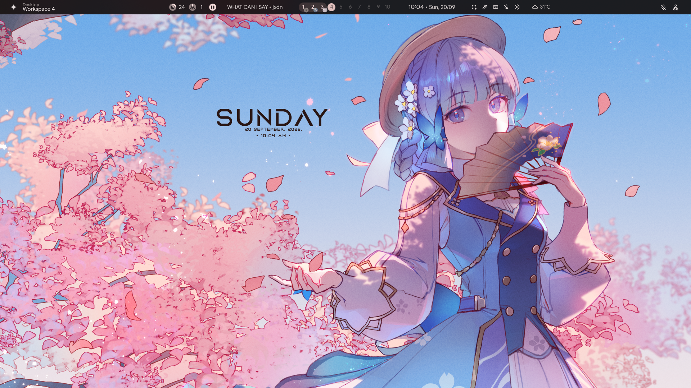

<p align="center">
  
</p>

# Arch Custom Installer

A simple Arch Linux restore/install script that downloads a prebuild system from Hugging Face, extracts it, and restores it into `/mnt`. Once the restore is finished, the script prints the exact commands you run manually to mount the EFI partition, generate `fstab`, and enter the installed system with `arch-chroot`.

> **IMPORTANT: This script is designed to be run from the Arch Linux Live environment.**

---

# READ THIS BEFORE INSTALLING

This is a **system restore script**, not a traditional Arch Linux installer.

The script restores the prebuild system into the filesystem mounted at:

```text
/mnt
```

**DO NOT run this script from an already installed Arch Linux system.**

This script is intended to be run from a **fresh Arch Linux Live environment**.

---

# ENVIRONMENT LOGIN

For the system environment used with this workflow:

```text
Username: live
Password: live
Root password: live
```

---

# REQUIREMENTS

Before running the script, make sure:

* You booted into the **Arch Linux Live ISO**
* You are working in the Live environment
* You have root access
* Internet connection is working
* The target filesystem is mounted at `/mnt`
* The target filesystem is **Btrfs**
* An EFI System Partition exists
* The EFI System Partition is prepared for `/boot/efi`
* You have verified that `/mnt` is the correct installation target

---

# TARGET FILESYSTEM

The target installation filesystem must be mounted at:

```text
/mnt
```

Verify:

```bash
findmnt /mnt
```

Check the filesystem type:

```bash
findmnt -no FSTYPE /mnt
```

Expected:

```text
btrfs
```

You can also check the available space:

```bash
df -h /mnt
```

> **WARNING:** Make absolutely sure `/mnt` points to the correct disk/partition before running the script.

The script will restore the system directly into `/mnt`.

---

# EFI SYSTEM PARTITION

A UEFI installation requires an **EFI System Partition (ESP)**.

The EFI partition must be available at:

```text
/boot/efi
```

> **IMPORTANT:** Do **NOT** mount the EFI System Partition to `/mnt/boot/efi` before the system restore.
>
> The prebuild filesystem already contains `/boot/efi`. If the ESP is mounted at `/mnt/boot/efi` before the restore, the mounted filesystem can hide the `/boot/efi` directory from the system and cause the restore to conflict with the existing EFI filesystem contents.
>
> The ESP must therefore be mounted **only after `pull.sh` has finished restoring the system**, right before you generate `fstab` and enter `arch-chroot` (the script prints these steps for you at the end).

---

# INSTALLATION

Boot the computer from the **Arch Linux Live ISO**.

Make sure you are inside the Live environment.

Check your disks:

```bash
lsblk -f
```

Mount your target Btrfs filesystem:

```bash
mount /dev/your-btrfs-partition /mnt
```

Verify:

```bash
findmnt /mnt
```

Verify that it is Btrfs:

```bash
findmnt -no FSTYPE /mnt
```

Expected:

```text
btrfs
```

> **DO NOT MOUNT THE EFI PARTITION HERE**
>
> At this point `/mnt` must contain only the target filesystem. Do **not** mount the ESP to `/mnt/boot/efi` yet.
>
> The restore process must first restore the prebuild system, including its `/boot/efi` directory, without another filesystem mounted over it.

---

# DOWNLOAD THE INSTALLER

The Arch Linux Live ISO does not include `git` by default. Install it first:

```bash
pacman -Sy git
```

Clone this repository:

```bash
git clone https://github.com/akimsupernova/akim-arch.git
```

Enter the repository:

```bash
cd akim-arch
```

Run the installer:

```bash
./pull.sh
```

The script will:

1. Check that you are root and connected to the internet
2. Download `akimpng.tar.gz` from Hugging Face
3. Extract it and restore its contents into `/mnt`
4. Clean up temporary files

When it's done, it does **not** mount the EFI partition, generate `fstab`, or enter `arch-chroot` automatically — it prints the exact commands for those steps so you can run each one yourself, in order.

---

# AFTER THE SCRIPT FINISHES

**THE INSTALLATION IS NOT FINISHED YET.**

Follow the three steps `pull.sh` prints at the end, in this exact order.

## Step 1 — Mount the EFI partition

**This is the required point to mount the EFI System Partition** — now that the restore is finished, but before generating `fstab` or entering the chroot.

```bash
mount /dev/your-efi-partition /mnt/boot/efi
```

Verify:

```bash
findmnt /mnt/boot/efi
```

It must show the EFI System Partition.

> **IMPORTANT:** The EFI partition is intentionally mounted here, **after the system has been restored**. Do not mount it at `/mnt/boot/efi` before running the restore.

## Step 2 — Generate fstab

Mounting the ESP first means it gets included correctly in `fstab`:

```bash
genfstab -U /mnt >> /mnt/etc/fstab
```

## Step 3 — Enter the chroot

```bash
arch-chroot /mnt
```

You are now inside the restored system.

# BOOTLOADER INSTALLATION IS REQUIRED

**THE EASY WAY: USE `efibootmgr`**

The restored system already has **`efibootmgr` and GRUB pre-installed**, so you do not need to install them again.

For the easiest UEFI boot setup, you can use `efibootmgr` to create a UEFI boot entry that points directly to the existing GRUB EFI loader.

First verify that the EFI System Partition is mounted **from inside the chroot**:

```bash
findmnt /boot/efi
```

Create a UEFI boot entry with:

```bash
grub-install --target=x86_64-efi --efi-directory=/boot/efi --bootloader-id=ArchLinux
```

After that:

```bash
grub-mkconfig -o /boot/grub/grub.cfg
```

> **NOTE:** `efibootmgr` creates the UEFI firmware boot entry. It does not install GRUB itself. In this restore workflow, GRUB is already present in the restored system, which is why `efibootmgr` can be used as the easy way to register it with the UEFI firmware.

If you prefer to reinstall/configure GRUB manually, you can still use the standard GRUB UEFI installation method for your system.

After the bootloader has been installed and configured:

```bash
exit
```

Then reboot:

```bash
reboot
```

Remove the Arch Linux USB/ISO when the system starts rebooting.

---

# NVIDIA GPU NOTE

If you have an **NVIDIA GPU**, driver setup is not guaranteed to work out of the box.

You may need to **troubleshoot the NVIDIA driver yourself** after first boot (proprietary vs open kernel modules, Wayland/Hyprland-specific env vars, etc.). This restore image is not tuned for every NVIDIA configuration, so check the [Arch Wiki NVIDIA page](https://wiki.archlinux.org/title/NVIDIA) and the [Hyprland NVIDIA guide](https://wiki.hypr.land/Nvidia/) if you run into graphical issues, black screens, or tearing.

---

# MONITOR CONFIGURATION (Hyprland)

The desktop environment is **Hyprland**. Monitor setup (resolution, refresh rate, position, scaling) is configured at:

```text
/home/live/.config/hypr/hyprland/general.lua
```

Edit this file to match your monitor(s). For a full guide on the available options and syntax, see the official Hyprland docs:

**[https://wiki.hypr.land/Configuring/Basics/Monitors/](https://wiki.hypr.land/Configuring/Basics/Monitors/)**

---

# Credits

**AKIMPNG**
