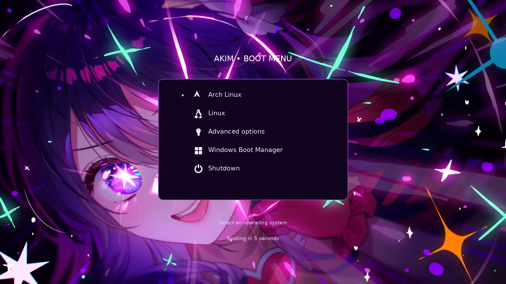

<p align="center">
  
</p>

# Arch Custom Installer

An install script that downloads a prebuilt Arch Linux system (Hyprland desktop).

> **Run this from the Arch Linux Live ISO only.** Never run it from an already installed system.
> The target partitions will be erased. Double-check your disk with `lsblk` first.

## Requirements

- UEFI system, **Secure Boot disabled**
- Internet connection
- Two partitions on the target disk:

| Partition | Size | Filesystem | Mount point |
|---|---|---|---|
| EFI System Partition | 1 GiB | FAT32 | `/mnt/boot` |
| System | Remaining space | Btrfs | `/mnt` |

## Installation

Boot the Arch Linux Live ISO ([download](https://archlinux.org/download/); on Windows use [Rufus](https://rufus.ie/en/) or [Ventoy](https://www.ventoy.net/en/download.html)), then:

**1. Partition the disk** (example: `/dev/nvme0n1`; SATA drives are usually `/dev/sda`)

```bash
lsblk
cfdisk /dev/nvme0n1
```

Choose `gpt`, create a `1G` partition (type **EFI System**) and use the rest as a Linux filesystem partition. Then **Write**, type `yes`, and **Quit**.

**2. Format**

```bash
mkfs.fat -F32 /dev/nvme0n1p1
mkfs.btrfs -f /dev/nvme0n1p2
```

**3. Mount (in this order)**

```bash
mount /dev/nvme0n1p2 /mnt
mkdir -p /mnt/boot
mount /dev/nvme0n1p1 /mnt/boot
```

Verify:

```bash
findmnt /mnt
findmnt /mnt/boot
```

> `/mnt` must be Btrfs and `/mnt/boot` must be the EFI partition **before** you run the script. The script stops if either is missing.

**4. Run the installer**

```bash
pacman -Sy git
git clone https://github.com/akimsupernova/akim-arch
cd akim-arch
./install.sh
```

The script downloads the system, restores it to `/mnt`, and generates `fstab`.

**5. Finish the installation by running this command**

```bash
installsystem
```

`installsystem` checks for missing files, downloads them, then builds and installs the bootloader to the EFI partition at `/boot`.

**6. Reboot**

```bash
exit
reboot
```

Remove the USB drive while the system restarts.

## First login

| | |
|---|---|
| Username | `arch` |
| Password | `arch` |
| Root password | `arch` |

Change them right away:

```bash
passwd arch
passwd
```

> Renaming the `arch` user is **not recommended**. The dotfiles and desktop config are hardcoded to `/home/arch`, and anything that breaks is your own responsibility.

## Keybindings

After the system is installed, press **`Super + /`** to open the keybinding cheatsheet.

## Monitor settings

Press **`Super + T`** to open Monitor Configuration (resolution, refresh rate, position, scaling).
See also the [Hyprland monitor docs](https://wiki.hypr.land/Configuring/Basics/Monitors/).

## Optional: GRUB theme
 
Want a nicer boot menu? Try my custom GRUB theme: [akim-grub-theme](https://github.com/akimsupernova/akim-grub-theme). Installation steps are in that repository.

<p align="center">
  
</p>

## NVIDIA GPU

NVIDIA drivers are not guaranteed to work out of the box. If you get a black screen or graphical issues, see the [Arch Wiki NVIDIA page](https://wiki.archlinux.org/title/NVIDIA) and the [Hyprland NVIDIA guide](https://wiki.hypr.land/Nvidia/).

## Credits

Based on [dots-hyprland](https://github.com/end-4/dots-hyprland) by [end-4](https://github.com/end-4), substantially modified and maintained by [Akim](https://github.com/akimsupernova).

Distributed under the GNU General Public License v3.0. See [LICENSE](LICENSE).
